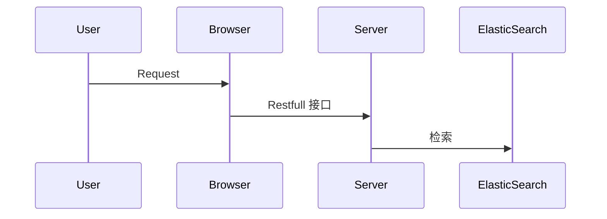

### 简介

理念
- 前后端分离

技术栈

- 前端: Vue or **ElementUI**
- 后端:  Java (**Springboot**框架) / Python 
- 数据库: **ElasticSearch**

相关概念

- Restful （**swagger**）
- Web容器: **Tomcat**
- 项目构建: Maven (pom.xml)
- 源码托管: gitee
- 项目部署: 云服务器 Linux （eg. 阿里云）

开发工具
- **IDEA**: https://www.jetbrains.com/idea/
- **VSCode**
- Git / TortoiseGit
- **MobaXterm** / XShell 

## 附录

### 参考

[RESTful](https://www.cnblogs.com/zhangruifeng/p/13257731.html)

[Swagger](https://www.oschina.net/p/swagger?hmsr=aladdin1e1)

[Vue3 教程](https://www.runoob.com/vue3/vue3-tutorial.html)

[ElementUI](https://element.eleme.cn/#/zh-CN)

